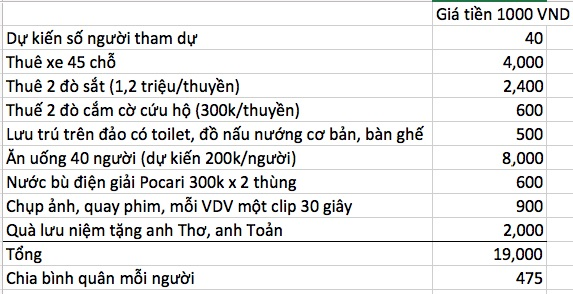

# Chương trình bơi Cấm Sơn

- Thời gian: Chủ nhật, 23/7/2017
- Thời gian sáng 6:00 xuất phát, chiều 7:00 về Hà nội, đi trong ngày.
- Khoảng cách: 120 km, thời gian di chuyển khoảng 2 tiếng, về 2 tiếng.

**Contact tại Cấm Sơn**

- Anh Điền lái đò máy, sinh năm 1975, thầy giáo. 01695655824
- Cụ Kiên, chủ đảo, 88 tuổi, 0984183297

# Ban tổ chức
- Thuê xe: a Giao
- Tạo form đăng ký, thu phí: a Toản
- Quà lưu niệm: a Toản - Cường
- Đội đi trước ngày thứ 7: a Tuấn - a Kiên - a Hưng: thuê đò, đặt tiệc liên hoan luôn: thực phẩm họ sẵn có thường là cá hồ, lợn.

# Chương trình cụ thể:
- 5:30 sáng xuất phát từ cổng lớn công viên Thống Nhất
- 8:10 xe sẽ đến xã Sơn Hải, đi bộ khoảng 600 mét ra bến đò.
- 8:20 đò sẽ trở đoàn đi một đoạn 5 km qua các đảo. Lúc này vải đã hết mùa, do đó sẽ không lên đảo hái nữa. 
- 9:10 thuyền cập một đảo cách đích 5 km
- 9:20 đội bơi bắt đầu bơi.
- 11:00 người bơi cuối cùng lên đảo ông Cụ
- 12:00 liên hoan - trao quà kỷ niệm - nghỉ trưa trên đảo ông Cụ
- 14:00 mọi người lên thuyền đi vòng quanh tất cả điểm ở hồ Cấm Sơn
- 16:30 về bến đò Sơn Hải
- 16:45 lên ô tô
- 19:00 về Hà nội trả ở cổng công viên Thống Nhất

# Ăn uống trên đảo
- Đảo có đủ mâm đũa bát cho khoảng 70 người. Trên đảo chỉ có 4 người sống do đó đoàn sẽ phải chủ động chuẩn bị nấu nướng từ lúc 10:00 sáng trước khi đội bơi cập đảo.
- Giá cá chép nặng trên 1kg là 150,000 VN/kg 
- Giá cá chắm cỏ là 100,000 VND/kg

# Dự tính chi phí:

# Phát sinh có thể xảy ra
- Số lượng người > 45. Phải thuê thêm 1 xe 16 chỗ
- Thuê 3 đò sắt. Mỗi đò chỉ nên chở 25 người hoặc ít hơn
- Mang thêm bát đũa hoặc thuê anh Điền hoặc ông Kiên

# Cơ sở vật chất trên đảo ông cụ Kiên 0984183297
- Đảo rộng khoảng 600 m2, có nhà sàn đủ cho 25 người ngủ qua đêm (thiếu màn, chiếu và chăn)
- Có sân rộng có thể nướng BBQ, trẻ con chạy nhảy chơi đùa, có 2 xích đu
- Từ đảo đi đường đất sẽ lên đồi và ra đường cắt ra cao tốc Hà nội Lạng Sơn đi khoảng 1.5km
- Có toilet, phòng tắm, điện nước đầy đủ, sạch sẽ
- Có sân mái che để cắm trại qua đêm
- Cần đặt gì phải báo trước 2 ngày.

# Bàn về các vấn đề khác
1. Có bác muốn đi 2 ngày 1 đêm ⇒ vậy hãy chủ động xuống Cấm Sơn từ buổi chiều thứ 7
2. Muốn bơi 10 km ⇒ hãy chủ động xuống Cấm Sơn từ buổi chiều thứ 7, sáng bơi từ 8:00 sáng
3. Muốn in pano chào mừng đoàn bơi hãy kỷ niệm sinh nhật ⇒ Do tính chất đảo là đảo không có nơi xử lý rác thải, in pano xong để lại trên đảo thì sinh rác vô cơ không cần thiết. Thậm chí giảm tối đa việc mang chai nhựa đựng nước lên đảo. Nếu mang lên thì phải mang về.
4. Muốn cho vợ con đi cùng, qua 45 người sẽ phải thuê thêm xe 16 chỗ, qua 50 người sẽ phải thuê thêm đò
5. Mưa lũ ở Bắc Giang trong tháng 7-8 có thể có. Trường hợp phát sinh biến cố ngoài dự đoán ví dụ CN đi, mà thứ 7 có tin mưa lũ lớn, đoàn có thể cancel rời lịch sang tuần sau.
6. Muốn ăn cá hồ Cấm Sơn ⇒ ok, cá ở đây có cá bắt từ hồ, cá nuôi lồng, nặng từ 4kg trở lên cũng có.
7. Muốn ăn vải ⇒ mùa vải đã hết, hẹn năm sau.
8. Có cần cắm cờ định vị không? ⇒ do điểm xuất phát rẽ ngoặt là đi thẳng nên không cần cắm cờ. Bác nào mệt cứ lên đảo, thuyền đi qua vẫy là đón.

# Nhận xét về hồ Cấm Sơn
- Hồ rất rộng 3000 ha gấp 6.7 lần hồ Tây 450 ha.
- Nước sạch, hoàn toàn không có chai lọ trôi trên hồ như hồ Ba bể, hay có rác củi như hồ Hoà Bình
- Cảnh hồ - đồi xen kẽ nhau, không có nhưng cây mọc hình thù cổ quái như hồ Ba Bể
- Thuyền bè đi lại rất ít, chủ yếu là thuyền nan , thuyền gỗ nhỏ câu cá
- Dịch vụ ở đây rẻ, người dân thân thiện
- Hồ nhiều cá, nếu đứng ở mép hồ trên bùn sẽ thấy cá nhỏ bơi ra rỉa chân buồn buồn.

